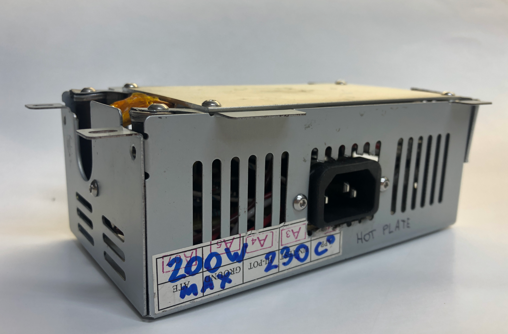
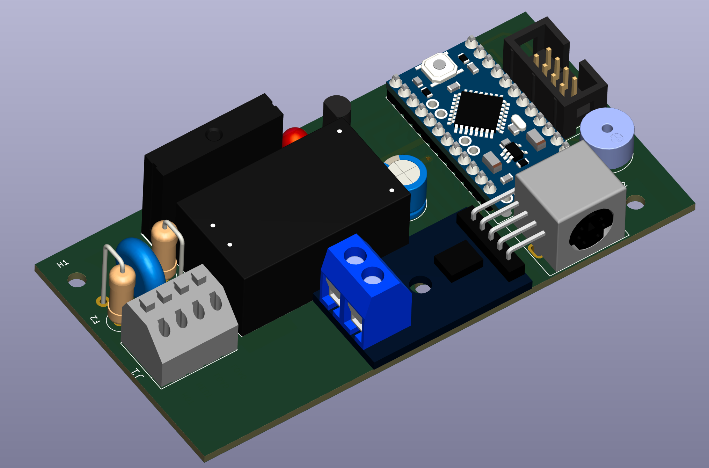
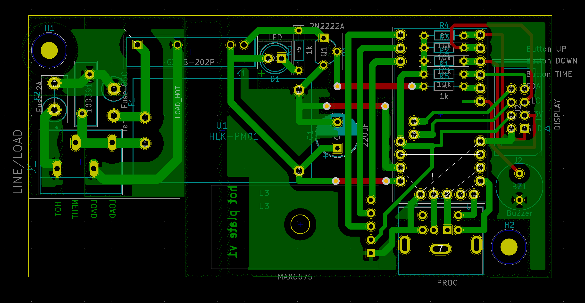
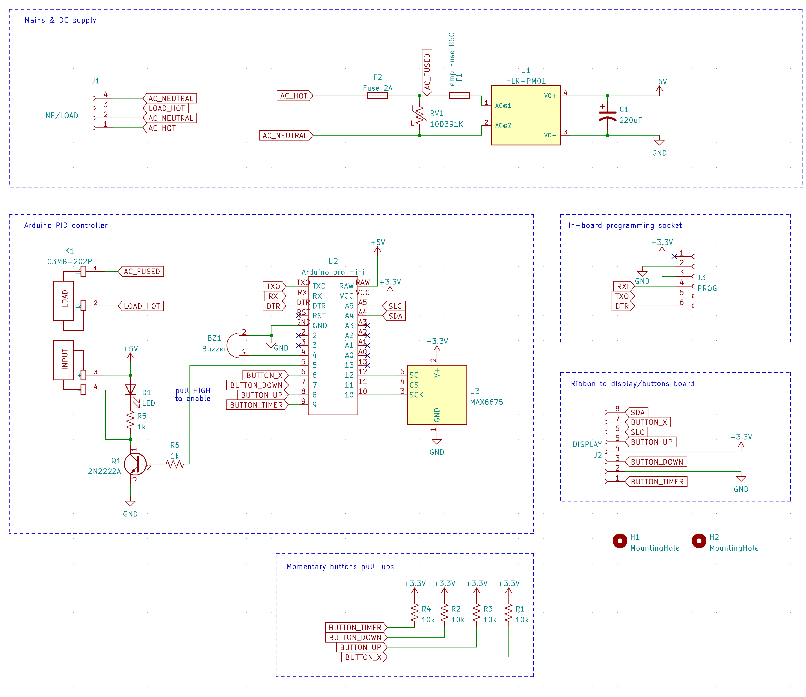
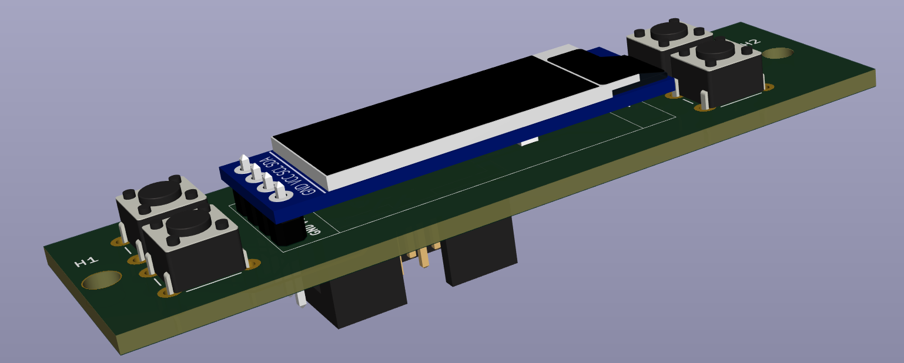
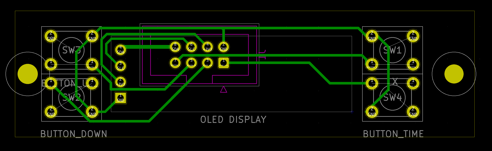
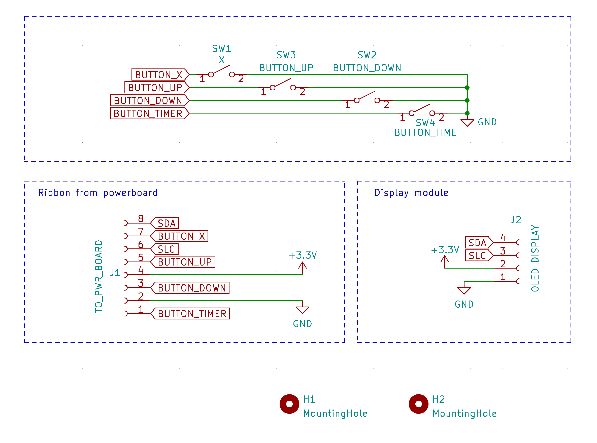
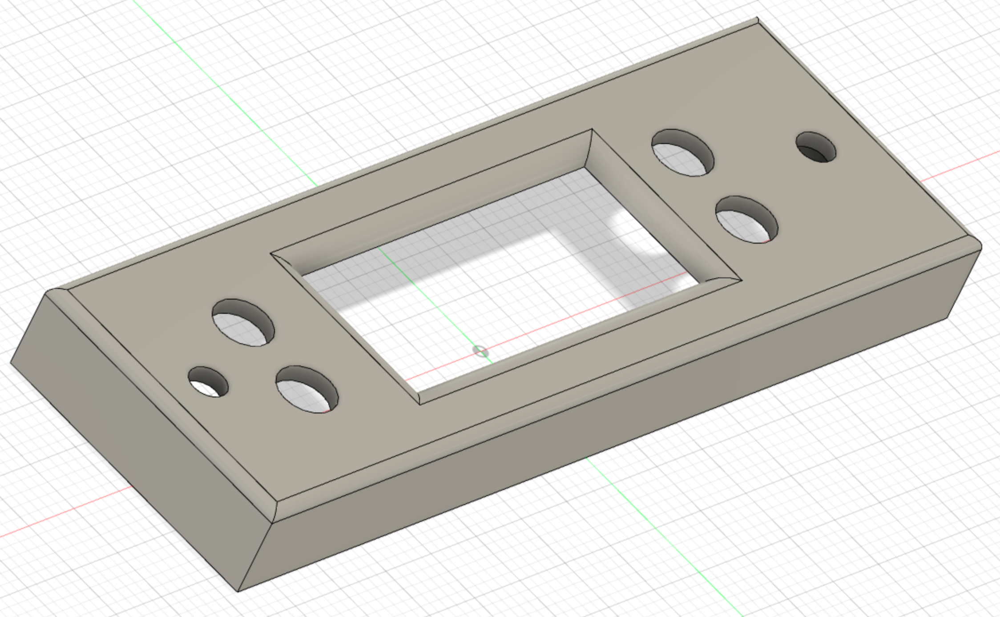

# Hot plate for PCB rework and reflow

 
 

# Notes

## General

The heating is not uniform (enough?). The father points of the hotplate are ~5C colder than the center, where the ceramic heating element is located. Typically, one would expect it to even out, but due to the high temperature of operation (150C-200C), fringes lose heat at a higher rate. 

A typical PCB is made of FR4 glass-reinforced epoxy resin laminate, turns out it's a decent insulator. As the result, the top side of the PCB is ~25C colder than the hotplate surface. Perhaps lots of plated vias would transfer the heat better. Add this 25C if running the plate on manual control. Adjust reflow profile accordingly.

If FR4 start to smoke - it's way too hot or too hot for way too long. If that has happened, the FR4 substrate has likely expanded already. So it might have ruined your impedance-controlled traces. 

Reflow should take less than 5min from the cold PCB to the end, all three phases - preheat, soak, reflow.

One good practice is to use the hot plate as preheating only, set it to ~150C and then use the hot air solder station to activate and melt the solder paste.

Temperature variation ±5C does not matter. You want to heat, solder, and cool down as fast as possible.

Max rate of heating for this particular hotplate element is about +2C/sec, still air colling is -1C/sec.

You can place some container/insulation over the hot plate to reduce the heat loss, but it only raises the temperature by about +5C. On the other hand, you can blow over the PCB and instantly lower the temperature by a few degrees.

## Hardware

The temperature probe must be placed right on the heater element or as close as possible. Any significant time delay between temperature control and measurement will destabilize the control loop. 
The wrong way is to put a thermocouple probe on the plate's far side. It introduces about 15seconds of dead time. 
The right way is to shove it into the ceramic heater.

Watch out for the metal case shorting signal lines to the ground. Everything on the low-voltage side of the PCB must be insulated from the metal enclosure.

The thermocouple wire can be cut to a convenient length.

## Software

MAX6675 has a resolution of 0.25C and an accuracy of ±2C. It takes approx ~200ms to take a reading, i.e., the fastest possible control loop cycle is 4Hz.

A solid-state relay can turn off at every 1/2 cycle of the AC sinus wave. The maximum delay for 60 Hz AC power is 1/2 cycle or 8.33 ms.
Every 266.67ms or 32 half AC cycles, the algo measures the temperature, does PID computations, and decides on the PWM duty cycle for the next control cycle.

PWM cycle is 266.67ms, which we split into 2^5 intervals. Therefore we have 2^5 control bits.
PID output variable will range from 0 to 32;
Timer2 is set for interrupts at a 120Hz rate (because half-cycles)

The Max rate of heating for this particular hotplate element is about +2C/sec below 180C and ~1C above, still air colling is approx +1C/sec. So Arduino PID library is modified to half differential coefficient to accommodate this.

I had fun fine-tuning PID coefficients to get a fast response and avoid overshoot, but this temperature fidelity does not mater. 

# Fabrication

Assemble all these pieces together
* Heating plate, [like this]("hot-plate.png")
* IEC 320-C14 Receptacle, Male Blades, panel mount, this is the socket at the back
* SPDT AC 250V switch, this is the main power switch
* metal case with lot's of slots
* 3d printed enclosure for display pcb, [picture](display-board-case.png) , [STEP file](display-case.step)
* two pcbs, see below
* M3 screews, washers, stand-outs, kapton tape, 14AWG wire for mains, thermocouple wire, IDC ribbon, silicon antiskid pads

## Safety

### Electrical
Bond ground wire from mains to the metal case, as soon as it enters the enclosure. Wire both hot and neutral through the SPDT switch to the pcb connectors. Observe neutral/hot polarity on the pcb. The hotplate aluminum is bonded via M3 screw via standout to the metal case.

The main pcb (power board) has a MOV and a 2A fuse. MCU is on isolated supply.

### Thermal 

Powerboard pcb has 85C thermal fuse to protect AC-DC convertor, wires and other electornic components. The temperature gradient below the hot plate is quite significant. When the hot plate is at +200C, the tallest point of the PCB, and thus the closest point to the hot measures +45C, with +20C ambient.

Arduino PID firmware limits (software) hotplate max temperature to +230C, the heating plate has +260C thermostat inside. Firmware also limits heating to 30min max.

## Power board 
 
 
 

### BOM
| Refs | Qty | Component | Description |
| ----- | --- | ---- | ----------- |
| BZ1 | 1 | Buzzer | Buzzer, polarized |
| C1 | 1 | 220uF | Polarized capacitor, US symbol |
| D1 | 1 | LED | Light emitting diode |
| F1 | 1 | Temp Fuse 85C | Fuse |
| F2 | 1 | Fuse 2A | Fuse |
| J1 | 1 | LINE/LOAD | Any wire to board connector |
| J2 | 1 | DISPLAY | IDC ribbon connector |
| J3 | 1 | PROG | Panel mount connector |
| K1 | 1 | G3MB-202P | https://www.mouser.com/datasheet/2/307/g3mb_0609-1189645.pdf |
| Q1 | 1 | 2N2222A | Any NPN transistor, collector/base/emitter |
| R1, R2, R3, R4 | 4 | 10k | Resistor |
| R5, R6 | 2 | 1k | Resistor |
| RV1 | 1 | 10D391K | https://www.mouser.com/datasheet/2/54/mov10d-777448.pdf |
| U1 | 1 | HLK-PM01 | https://datasheet.lcsc.com/szlcsc/1909111105_HI-LINK-HLK-PM24_C399250.pdf |
| U2 | 1 | Arduino | Any AVR MCU with 32Kb+ of flash, 2Kb+ of RAM |
| U3 | 1 | MAX6675 | https://datasheets.maximintegrated.com/en/ds/MAX6675.pdf |

## Display board 

 
 
 

### BOM

| Refs | Qty | Component | Description |
| ----- | --- | ---- | ----------- |
| J1 | 1 | TO_PWR_BOARD | IDC ribbon connector |
| J2 | 1 | OLED DISPLAY | 0.91" OLED LCD Display Module SSD1306 IIC 128x32|
| SW1,SW2,SW3,SW4 | 1 | BUTTON_X | Momentary switch, button should be tall enough to stick out from the case |

  
 

[STEP file]("display-case.step")
.

